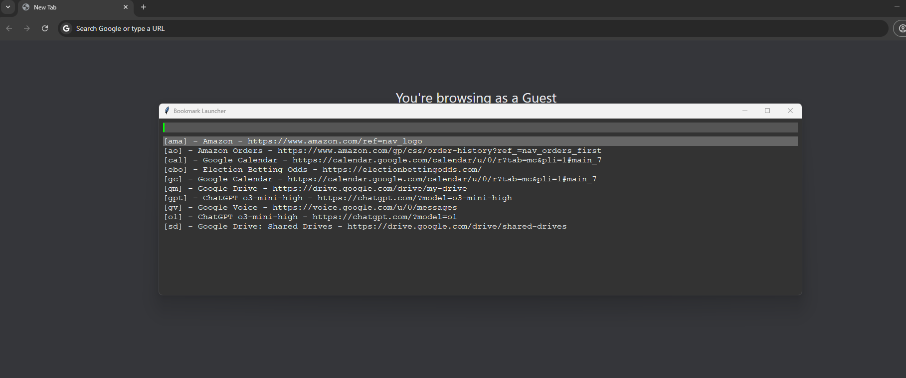

# launcher
Launch programs and tabs quickly on Windows

Run `launcher.ahk` with AutoHotkey v2.

Press `F1` to open the launcher.

Use type-ahead to select the entry you want.

Press `Enter` to go to the highlighted entry.

Press `Esc` to close the window.
Changing window focus will also close the window.

Edit `bookmarks.yml` to change the bookmarks.
The structure is fairly self-explanatory.
